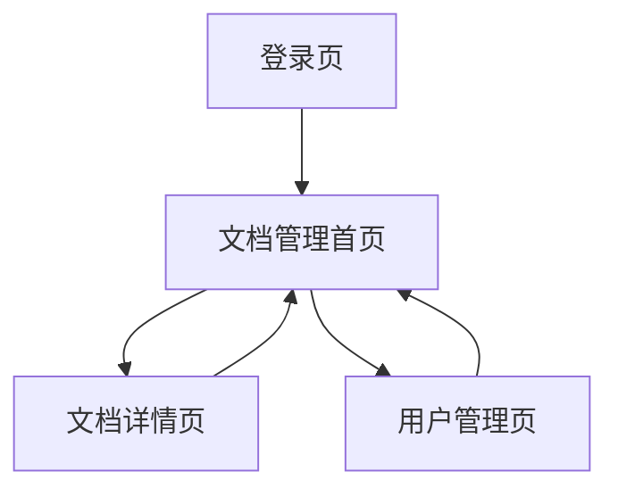

## 1. 产品概述
文档管理系统是一个企业级文件管理平台，提供统一的文档存储、分类、搜索和管理功能。该系统帮助团队高效管理和共享各类文档资源，提升协作效率。

## 2. 核心功能

### 2.1 用户角色
| 角色 | 注册方式 | 核心权限 |
|------|----------|----------|
| 普通用户 | 邮箱注册 | 浏览、上传、下载文档 |
| 管理员 | 系统分配 | 管理用户、配置系统、查看所有文档 |

### 2.2 功能模块
文档管理系统包含以下核心页面：
1. **文档管理首页**：左侧导航栏、文件夹树形结构、搜索结果展示、文档列表管理。
2. **文档详情页**：文档预览、元信息展示、版本管理、权限设置。
3. **用户管理页**：用户列表、角色分配、权限配置。

### 2.3 页面详情
| 页面名称 | 模块名称 | 功能描述 |
|----------|----------|----------|
| 文档管理首页 | 左侧导航栏 | 显示系统主要功能模块图标，支持快速切换 |
| 文档管理首页 | 文件夹树 | 展示文档层级结构，支持展开折叠 |
| 文档管理首页 | 搜索工具栏 | 提供搜索框、视图切换、排序选项 |
| 文档管理首页 | 文件夹卡片 | 以卡片形式展示文件夹，显示文件数量 |
| 文档管理首页 | 文档列表 | 表格形式展示文档详情，支持启用禁用、下载操作 |
| 文档详情页 | 文档预览 | 支持多种格式文档在线预览 |
| 文档详情页 | 元信息展示 | 显示文档大小、上传者、创建时间等信息 |
| 用户管理页 | 用户列表 | 展示所有用户信息 |
| 用户管理页 | 权限配置 | 设置用户角色和访问权限 |

## 3. 核心流程
用户登录系统后，默认进入文档管理首页。在左侧导航栏选择功能模块，通过文件夹树浏览文档分类，使用搜索工具栏快速定位文档。可以切换网格或列表视图，对文档进行启用禁用、下载等操作。

## 4. 用户界面设计

### 4.1 设计风格
- **主色调**：橙色（#FF6B35）作为强调色，灰色（#666666）作为主要文字色
- **按钮样式**：圆角矩形设计，主要按钮使用橙色背景
- **字体**：系统默认字体，标题16px，正文14px
- **布局风格**：三栏式布局，左侧固定导航，中间树形结构，右侧内容区域
- **图标风格**：线性图标，简洁现代风格

### 4.2 页面设计概览
| 页面名称 | 模块名称 | UI元素 |
|----------|----------|--------|
| 文档管理首页 | 左侧导航栏 | 橙色背景激活状态，白色图标，灰色未激活状态 |
| 文档管理首页 | 文件夹树 | 浅灰色背景，黑色文字，层级缩进显示 |
| 文档管理首页 | 搜索工具栏 | 圆角搜索框，灰色边框，右侧操作按钮 |
| 文档管理首页 | 文件夹卡片 | 白色卡片带阴影，灰色文件夹图标，文件数量显示 |
| 文档管理首页 | 文档列表 | 白色表格，交替行背景，橙色开关按钮，蓝色操作链接 |

### 4.3 响应式设计
采用桌面端优先设计，支持平板和桌面设备。主要功能在1200px以上宽度显示最佳效果。