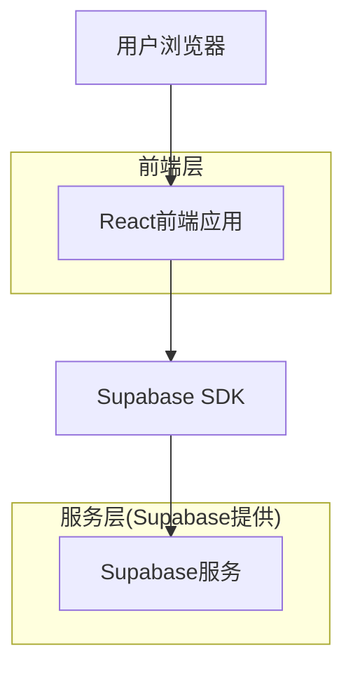
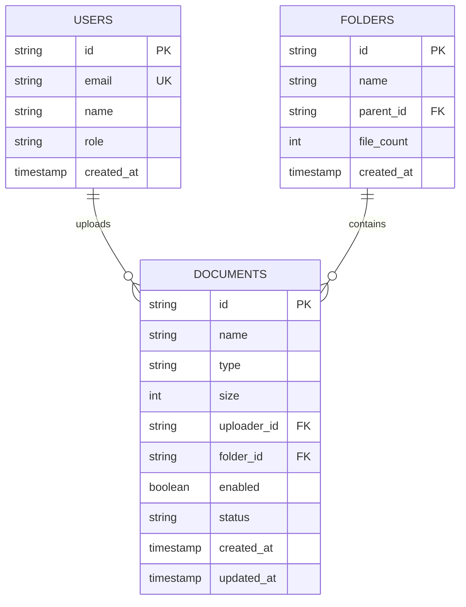

## 1. 架构设计



## 2. 技术栈描述

- **前端**: React@18 + tailwindcss@3 + vite
- **初始化工具**: vite-init
- **后端**: Supabase (提供认证、数据库、存储服务)

## 3. 路由定义

| 路由 | 用途 |
|------|------|
| / | 文档管理首页，主要功能界面 |
| /login | 登录页面，用户身份验证 |
| /document/:id | 文档详情页，展示文档信息和预览 |
| /users | 用户管理页面，管理用户权限 |

## 4. API定义

### 4.1 文档管理API

**获取文档列表**
```
GET /api/documents
```

请求参数：
| 参数名 | 参数类型 | 是否必需 | 描述 |
|--------|----------|----------|------|
| folder_id | string | false | 文件夹ID，筛选特定文件夹 |
| search | string | false | 搜索关键词 |
| sort | string | false | 排序方式 |

响应：
```json
{
  "documents": [
    {
      "id": "doc_123",
      "name": "API接口文档.docx",
      "size": "0.8MB",
      "uploader": "王五",
      "created_at": "2024-02-11 09:15",
      "updated_at": "2024-02-11 09:15",
      "enabled": true,
      "status": "预览"
    }
  ]
}
```

**更新文档状态**
```
PUT /api/documents/:id/status
```

请求：
```json
{
  "enabled": false
}
```

## 5. 数据模型

### 5.1 数据模型定义



### 5.2 数据定义语言

**用户表 (users)**
```sql
-- 创建用户表
CREATE TABLE users (
  id UUID PRIMARY KEY DEFAULT gen_random_uuid(),
  email VARCHAR(255) UNIQUE NOT NULL,
  password_hash VARCHAR(255) NOT NULL,
  name VARCHAR(100) NOT NULL,
  role VARCHAR(20) DEFAULT 'user' CHECK (role IN ('user', 'admin')),
  created_at TIMESTAMP WITH TIME ZONE DEFAULT NOW(),
  updated_at TIMESTAMP WITH TIME ZONE DEFAULT NOW()
);

-- 创建索引
CREATE INDEX idx_users_email ON users(email);
CREATE INDEX idx_users_role ON users(role);
```

**文件夹表 (folders)**
```sql
-- 创建文件夹表
CREATE TABLE folders (
  id UUID PRIMARY KEY DEFAULT gen_random_uuid(),
  name VARCHAR(255) NOT NULL,
  parent_id UUID REFERENCES folders(id),
  file_count INTEGER DEFAULT 0,
  created_at TIMESTAMP WITH TIME ZONE DEFAULT NOW(),
  updated_at TIMESTAMP WITH TIME ZONE DEFAULT NOW()
);

-- 创建索引
CREATE INDEX idx_folders_parent ON folders(parent_id);
```

**文档表 (documents)**
```sql
-- 创建文档表
CREATE TABLE documents (
  id UUID PRIMARY KEY DEFAULT gen_random_uuid(),
  name VARCHAR(255) NOT NULL,
  type VARCHAR(50) NOT NULL,
  size INTEGER NOT NULL,
  uploader_id UUID REFERENCES users(id),
  folder_id UUID REFERENCES folders(id),
  enabled BOOLEAN DEFAULT true,
  status VARCHAR(20) DEFAULT '预览',
  file_path TEXT,
  created_at TIMESTAMP WITH TIME ZONE DEFAULT NOW(),
  updated_at TIMESTAMP WITH TIME ZONE DEFAULT NOW()
);

-- 创建索引
CREATE INDEX idx_documents_folder ON documents(folder_id);
CREATE INDEX idx_documents_uploader ON documents(uploader_id);
CREATE INDEX idx_documents_created ON documents(created_at DESC);

-- 设置权限
GRANT SELECT ON documents TO anon;
GRANT ALL PRIVILEGES ON documents TO authenticated;
```

**初始化数据**
```sql
-- 插入初始文件夹数据
INSERT INTO folders (name, file_count) VALUES 
  ('产品推广素材', 9),
  ('技术研发文档', 6),
  ('财务报表(绝密)', 0);

-- 插入初始文档数据
INSERT INTO documents (name, type, size, uploader_id, folder_id, status) VALUES
  ('活动现场_02.jpg', 'image', 3670016, (SELECT id FROM users WHERE name = '市场部' LIMIT 1), (SELECT id FROM folders WHERE name = '产品推广素材' LIMIT 1), '预览'),
  ('API接口文档.docx', 'document', 838860, (SELECT id FROM users WHERE name = '王五' LIMIT 1), (SELECT id FROM folders WHERE name = '技术研发文档' LIMIT 1), '预览');
```